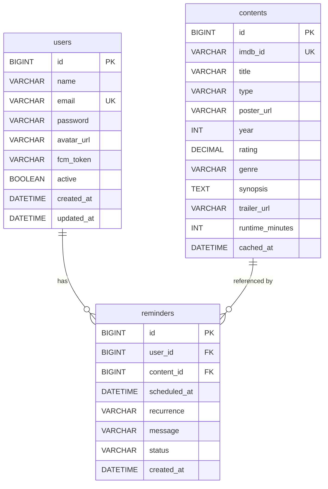

# 🎬 CineAlert

**CineAlert** é um aplicativo mobile de lembretes e notificações personalizadas de filmes e séries — pesquise títulos no IMDB e nunca perca um lançamento.

---

## 📐 Arquitetura

```
cine-alert/
├── backend/        → Spring Boot 3.2 + Java 21 + SQLite
└── mobile/         → Flutter 3.16 + Riverpod + GoRouter
```

### ER Diagram



---

## 🚀 Setup — Backend (Spring Boot)

### Pré-requisitos
- Java 21+
- Maven 3.8+

### 1. Configurar variáveis de ambiente

```bash
cd backend
cp .env.example .env
# Edite .env com seus valores (o banco SQLite é criado automaticamente)
```

### 2. Executar

```bash
cd backend
# Windows
set IMDB_API_KEY=4c734d2690msh7f096ff24445fd2p191bd6jsnd0c04fe350c7
mvnw.cmd spring-boot:run

# Linux/Mac
export IMDB_API_KEY=4c734d2690msh7f096ff24445fd2p191bd6jsnd0c04fe350c7
./mvnw spring-boot:run
```

O banco de dados SQLite é criado automaticamente em `./data/cinealert.db`.

### 3. Acessar Swagger UI

> http://localhost:8080/swagger-ui.html

---

## 📱 Setup — Flutter Mobile

### Pré-requisitos
- Flutter 3.16+ (`flutter --version`)
- Android Studio ou VS Code com extensão Flutter
- Emulador Android ou dispositivo físico

### 1. Instalar dependências

```bash
cd mobile
flutter pub get
```

### 2. Configurar URL do backend

O app usa `http://10.0.2.2:8080` por padrão (que aponta para localhost no emulador Android).

Para dispositivo físico ou IP diferente, passe via `--dart-define`:

```bash
flutter run --dart-define=BASE_URL=http://SEU_IP:8080
```

### 3. Executar

```bash
cd mobile
flutter run
```

---

## 🔌 API Reference

### Autenticação

| Método | Endpoint | Descrição |
|--------|----------|-----------|
| POST | `/api/auth/register` | Cadastrar usuário |
| POST | `/api/auth/login` | Login com email/senha |
| POST | `/api/auth/refresh` | Renovar access token |
| POST | `/api/auth/logout` | Logout |
| POST | `/api/auth/forgot-password` | Solicitar redefinição de senha |

### Conteúdo (IMDB)

| Método | Endpoint | Descrição |
|--------|----------|-----------|
| GET | `/api/content/search?q={query}` | Buscar filmes/séries |
| GET | `/api/content/{imdbId}` | Detalhe do título |
| GET | `/api/content/trending` | Filmes em alta |
| GET | `/api/content/genres` | Lista de gêneros |

### Lembretes 🔒

| Método | Endpoint | Descrição |
|--------|----------|-----------|
| GET | `/api/reminders` | Listar meus lembretes |
| POST | `/api/reminders` | Criar lembrete |
| GET | `/api/reminders/{id}` | Detalhe do lembrete |
| PUT | `/api/reminders/{id}` | Atualizar lembrete |
| DELETE | `/api/reminders/{id}` | Cancelar lembrete |
| GET | `/api/reminders/stats` | Estatísticas |

### Usuário 🔒

| Método | Endpoint | Descrição |
|--------|----------|-----------|
| GET | `/api/users/me` | Perfil do usuário |
| PUT | `/api/users/me` | Atualizar perfil |
| PUT | `/api/users/me/avatar` | Atualizar avatar |
| DELETE | `/api/users/me` | Desativar conta |

### Notificações 🔒

| Método | Endpoint | Descrição |
|--------|----------|-----------|
| POST | `/api/notifications/token` | Registrar token FCM |

> 🔒 = requer `Authorization: Bearer <access_token>`

---

## 🔥 Firebase / FCM Setup

Quando você tiver o `google-services.json`:

1. Coloque o arquivo em `mobile/android/app/google-services.json`
2. No backend, obtenha o JSON do Firebase Admin SDK e configure:
   ```
   FIREBASE_CREDENTIALS_PATH=./firebase-credentials.json
   FIREBASE_ENABLED=true
   ```
3. Reconstrua e execute o app.

---

## 🐳 Docker (Backend)

```bash
cd backend
docker build -t cinealert-backend .
docker run -p 8080:8080 \
  -e IMDB_API_KEY=sua_chave \
  -e JWT_SECRET=seu_secret_super_longo \
  -v $(pwd)/data:/app/data \
  cinealert-backend
```

---

## 🧪 Testes

```bash
# Backend
cd backend && mvnw test

# Flutter
cd mobile && flutter test
```

---

## 🛠️ Variáveis de Ambiente

Veja [`backend/.env.example`](backend/.env.example) para a lista completa.
